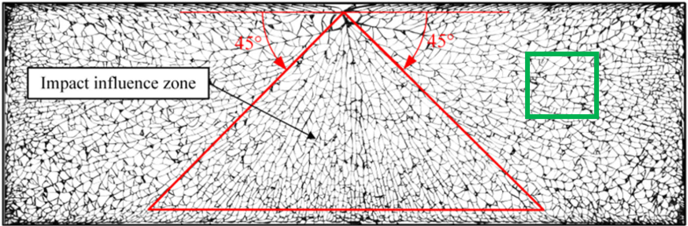
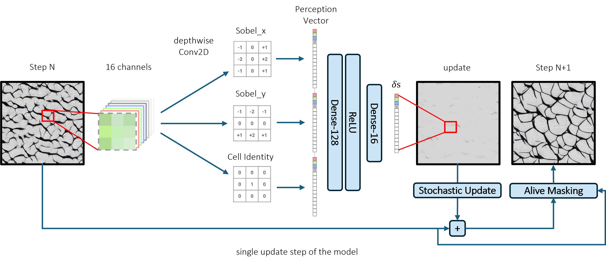
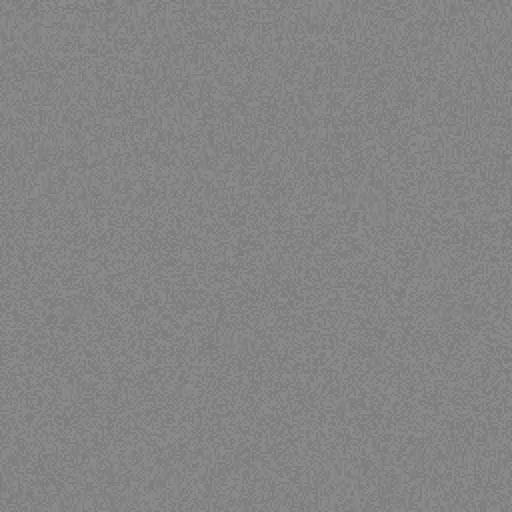
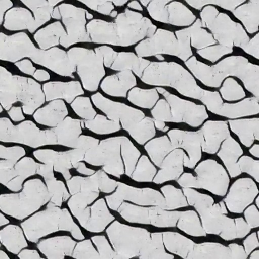
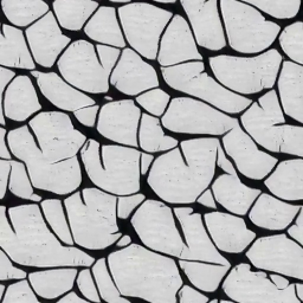
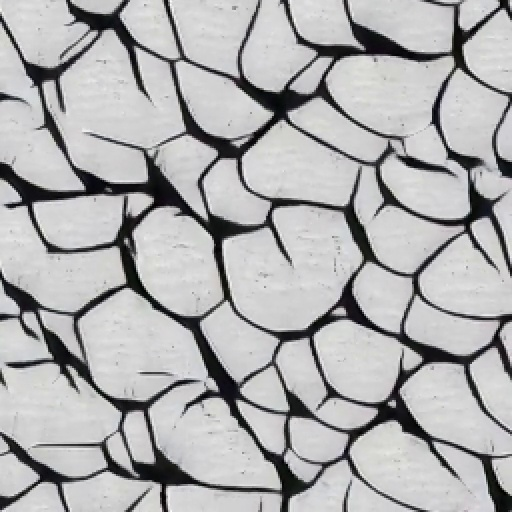
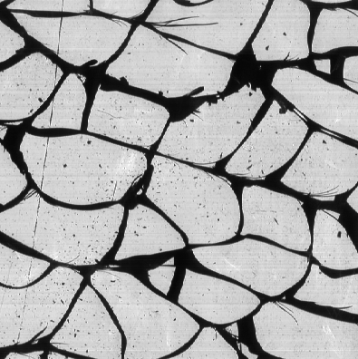
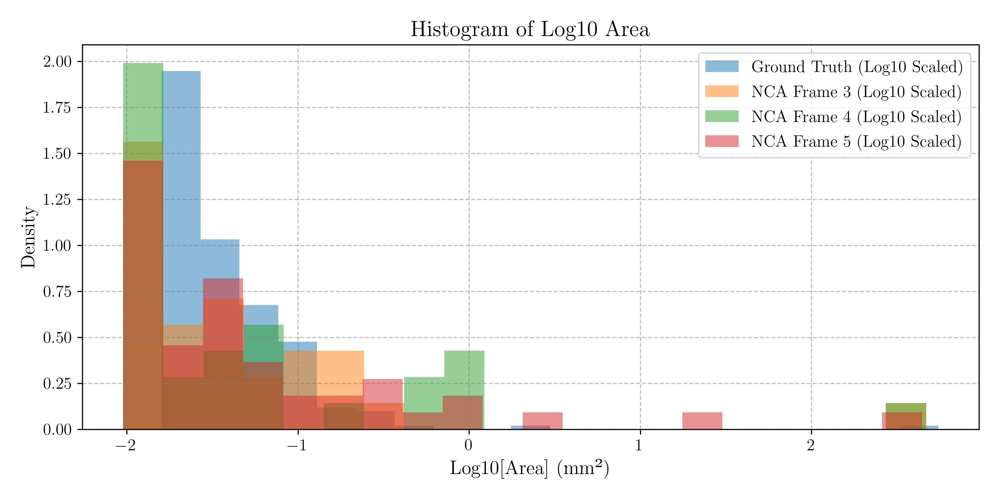
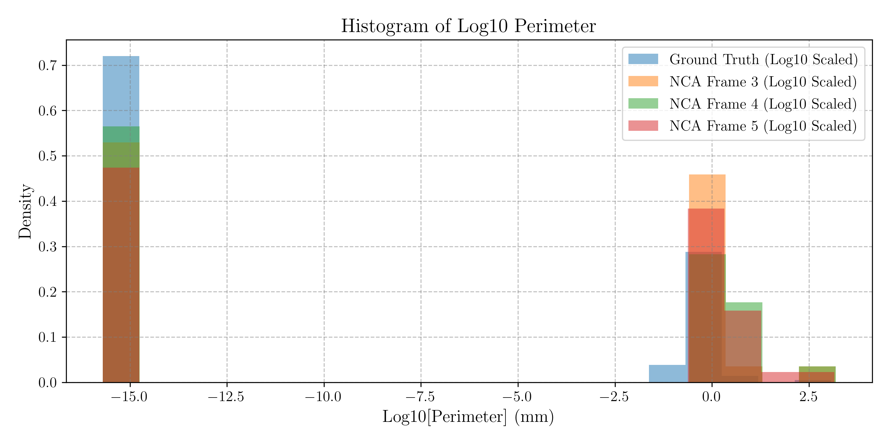

<!--https://mkrausai.github.io/research/01_SciML/02_Overstrength-->

# Implicit Fracture Morphology Modelling for Pre-Stressed Glass via Neural Cellular Automata

<!-- A repository of structural information on the design of pedestrian bridges
============================== -->

*   [Abstract](#Abstract)
*   [Introduction](#intro)
*   [Methods](#methods)
*   [Results](#results)
*   [Conclusions and Outlook](#Conclusions)
*   [Literature](#Literature)
*   [Contributors](#contributors)

<!-- -->
<!-- *   [Citation](#citation)-->

## Abstract
Since decades, researcher are investigating the modelling of the fracture morphology of glasses - especially for prestressed glasses. As an alternative to existing mechanics-based or explicit statistical approaches, we propose neural implicit modelling via Neural Cellular Automata (NCA) to simulate microstructure development during the fracture process in pre-stressed glasses. Based on convolutional neural network, NCA can learn essential solidification features, such as preferred growth direction and competitive grain growth. The proposed NCA are more accurate than the “BREAK” method towards texture and geometrical features as well as orders of magnitude faster than the conventional Phase-Field or Finite-Element-based models. While this study employs images of fractured glass panes as training data, NCA can also be trained based on any microstructural simulation data or a mix of synthetic and actual data.

<!-- The publication can be found <a href="https://onlinelibrary.wiley.com/doi/10.1002/cepa.2587" target="_blank">here</a> and the corresponding presentation video <a href="https://youtu.be/h-iBCey2fKo" target="_blank">here</a>. -->

## Introduction
Glass, known for its brittleness and low tensile strength, is highly influenced by surface defects, limiting structural applications. Tempering enhances its strength by inducing a parabolic residual stress distribution, with zero stress at 20% of the glass thickness. Advances in statistical modeling and machine learning, such as the BREAK model by Kraus et al. (2019), have improved fracture pattern predictions using Voronoi tessellations and stochastic processes. Pourmoghaddam et al. (2019) established links between strain energy and fracture morphology, advancing 2D fragmentation prediction. Meanwhile, deep learning approaches, including works by Drass et al. (2021) and Riedel et al. (2024), enable precise crack detection in fracture imagery. Neural Cellular Automata (NCA), which learn flexible update rules from data, have shown promise in modeling complex phenomena like texture generation (Mordvintsev et al. (2020)) and metal solidification (Tang et al. (2023)). This paper applies NCA to glass fractures, capturing stochastic variability and learning implicit rules from fracture images.

## Methods

###  Pre-Stressed Glass Fracture Data
This study employs fracture data from Pourmoghaddam et al. (2019) on thermally tempered glass specimens. The dataset consists of a 50 mm cutout from a 12 mm-thick glass plate with mid-plane pre-stress of 31.5 MPa and energy density of 8738.2 J/m³. A visualization of the fractured specimen is shown below:

<figure>
  
  <figcaption>Fractured specimen with impact influence zone and NCA training region (green box).</figcaption>
</figure>

###  Neural Cellular Automata (NCA)
The proposed NCA framework, based on Mordvintsev et al. (2020), operates on a 2D grid with 12 channels per cell. It uses convolutional kernels and a compact neural network to model fracture patterns. An update step is illustrated below:
<figure>
  
  <figcaption>Training scheme for NCA model based on Mordvintsev et al. (2020).</figcaption>
</figure>

The NCA applies a stochastic update rule and uses a small network with 5,856 parameters, achieving efficient grid-based fracture texture simulations. Despite its small size, the model performs well without requiring hyperparameter optimization.

###  Evaluation Metrics of Fractured Glass
The fractured shards, generated by the NCA and ground truth data, were evaluated using qualitative and quantitative methods:
<ul>
  <li><strong>Area:</strong> Number of pixels constituting a shard</li>
  <li><strong>Orientation:</strong> Angle between the x-axis and the shard's major axis</li>
  <li><strong>Eccentricity:</strong> Elongation of a shard from circular (0) to linear (1)</li>
  <li><strong>Perimeter:</strong> Boundary length of a shard</li>
  <li><strong>Major Axis Length</strong></li>
  <li><strong>Minor Axis Length</strong></li>
</ul>
These metrics provided a robust framework for assessing the fidelity and diversity of the generated fracture patterns compared to the ground truth.

Instead of using conventional metrics such as Fréchet inception distances (FID), this study compares the probability distributions of geometric features (e.g., area, perimeter) extracted from images at time steps \( t \geq 0.5 \), following the approach of Kraus et al. (2019).

##  Results
The following images show sample frames ("Frame 0" to "Frame 5") from the NCA training process at various time steps. Qualitatively, there is strong agreement between the ground truth fracture pattern and the textures learned by the NCA, especially for training times \( t \geq 0.5 \). A video of the learned fracture texture can be found <a href="https://mkrausai.github.io/research/01_SciML/04_NCA_GlassFracture/" target="_blank">here</a>.

  <figure style="text-align: center;">
    
    <figcaption>Frame 1: \( t = 0 \)</figcaption>
  </figure>
  <figure style="text-align: center;">
    
    <figcaption>Frame 2: \( t = 0.25 \)</figcaption>
  </figure>
  <figure style="text-align: center;">
    
    <figcaption>Frame 3: \( t = 0.50 \)</figcaption>
  </figure>
  <figure style="text-align: center;">
    
    <figcaption>Frame 4: \( t = 0.75 \)</figcaption>
  </figure>
  <figure style="text-align: center;">
    
    <figcaption>Frame 5: \( t = 1.0 \)</figcaption>
  </figure>
  <figure style="text-align: center;">
    
    <figcaption>Ground Truth</figcaption>
  </figure>

For the main geometric evaluation metrics (area, perimeter, major axis length, minor axis length) we provide the histograms using 10-log of the metrics due to their numerical values spanning several scales:

  <!-- Log Area -->
  <figure style="text-align: center; width: 45%;">
    
    <figcaption>Log Area</figcaption>
  </figure>
    
  <!-- Log Perimeter -->
  <figure style="text-align: center; width: 45%;">
    
    <figcaption>Log Perimeter</figcaption>
  </figure>
  
  <!-- Log Major Axis Length -->
  <figure style="text-align: center; width: 45%;">
    
    <figcaption>Log Major Axis Length</figcaption>
  </figure>
  
  <!-- Log Minor Axis Length -->
  <figure style="text-align: center; width: 45%;">
    
    <figcaption>Log Minor Axis Length</figcaption>
  </figure>

We provide a video of the trained NCA generating fracture patterns of tempered glass here: 

  <video autoplay loop muted style="width: 10cm; height: 10cm;">
    <source src="NCA_FracturedGlass.mp4" type="video/mp4">
    Your browser does not support the video tag.
  </video>
  

    Video of the NCA generating fracture patterns of tempered glass with 
    <code>UD = 8,738.2 J/m³</code> (<code>Uσm = 31.5 MPa</code>) in an area of 50 x 50 mm.
  

##  Conclusions and Outlook
This study demonstrates the efficacy of Neural Cellular Automata (NCA) for modeling tempered glass fracture patterns, outperforming traditional methods in speed and accuracy. By capturing intricate morphologies and stochastic variability, NCA effectively replicates complex fracture patterns with strong alignment to ground truth data, as evidenced by metrics such as perimeter, area, and axis lengths.

However, key limitations include the use of a single training image and the lack of temporal data to model dynamic fracture processes. Addressing these challenges could significantly enhance the model's capabilities. Incorporate high-speed imaging data (e.g., Riedel et al., 2024) to enable NCA training with spatio-temporal sequences, simulating crack propagation dynamics.

Develop a Conditional Variational NCA (VNCA) framework to generate fracture patterns specific to varying prestress levels, capturing full stochastic variability and correlation structures inherent in fracture data. Explore probabilistic methods and conduct hyperparameter searches to optimize the model's architecture, further improving  accuracy and generalizability.

These advancements could expand the applicability of NCA in structural glass engineering, providing powerful tools for simulating and analyzing fracture patterns under diverse conditions.

##  Conclusions and Outlook
This study addresses the regression of overstrength factors for specific types of steel sections. We propose novel methods for formulating relations between cross-sectional features and the overstrength of beams in CHS, RHS, SHS, I, and H sections. We introduce a multi-head encoder-regressor Deep Neural Network (MHER-DNN) architecture to predict the overstrength factor and learn a compressed representation of section-specific inputs for regression and inspection purposes. Experimental data for different cross sections are used to train and validate the MHER-DNN. The model shows reasonable precision and accuracy compared to existing models. We also explore the disentanglement of the latent space representation of the MHER-DNN, allowing for common feature derivation and human interpretation. Future research involves further tuning of hyperparameters, investigating hybrid autoencoder-multi-head regressor architectures, and establishing Eurocode-compliant models for engineering design practice.

##  Literature

<ul>
  <li>
    Pourmoghaddam, N., Kraus, M. A., Schneider, J., & Siebert, G. (2019). 
    <em>Relationship between strain energy and fracture pattern morphology of thermally tempered glass for the prediction of the 2D macro-scale fragmentation of glass</em>. 
    <strong>Glass Structures & Engineering</strong>, 4(2), 257–275.
  </li>
  <li>
    Kraus, M. A. (2019). 
    <em>Machine learning techniques for the material parameter identification of laminated glass in the intact and post-fracture state</em>. 
    <strong>Universität der Bundeswehr</strong>.
  </li>
  <li>
    Tang, J., Kumar, S., De Lorenzis, L., & Hosseini, E. (2023). 
    <em>Neural Cellular Automata for Solidification Microstructure Modelling</em>. 
    <strong>Computer Methods in Applied Mechanics and Engineering</strong>, 414, 116197.
  </li>
  <li>
    Mordvintsev, A., & Niklasson, E. (2021). 
    <em>μ NCA: Texture generation with ultra-compact neural cellular automata</em>. 
    <strong>arXiv preprint</strong>, arXiv:2111.13545.
  </li>
  <li>
    Drass, M., Berthold, H., Kraus, M. A., & Müller-Braun, S. (2021). 
    <em>Semantic segmentation with deep learning: detection of cracks at the cut edge of glass</em>. 
    <strong>Glass Structures & Engineering</strong>, 6(1), 21–37.
  </li>
  <li>
    Riedel, H., Bohmann, L., Bagusat, F., Sauer, M., Schuster, M., & Seel, M. (2024). 
    <em>Crack segmentation for high-speed imaging: detection of fractures in thermally toughened glass</em>. 
    <strong>Glass Structures & Engineering</strong>, 1–14.
  </li>
</ul>

## Contributors

  

    
    
 
      <strong>Univ.-Prof. Dr. Michael A. Kraus, M.Sc.(hons)</strong>  
      Professor Structural Mechanics and Design at TU Darmstadt 
    

  

  

    
    

      <strong>Univ.-Prof. Dr. Jens Schneider</strong>  
      President of TU Wien 
    

  

# Contact
Univ.-Prof. Dr. Michael A. Kraus, M.Sc.(hons) 
Institute für Statik und Konstruktion (ISM+D) 
TU Darmstadt 
kraus@ismd.tu-darmstadt.de 
<a href="https://www.ismd.tu-darmstadt.de/das_institut_ismd/mitarbeiter_innen_ismd/team_ismd_details_109888.de.jsp">
  Visit Univ.-Prof. Dr. Michael A. Kraus
</a>

------------
Shield: [![CC BY 4.0][cc-by-shield]][cc-by]

This work is licensed under a
[Creative Commons Attribution 4.0 International License][cc-by].

[![CC BY 4.0][cc-by-image]][cc-by]

[cc-by]: http://creativecommons.org/licenses/by/4.0/
[cc-by-image]: https://i.creativecommons.org/l/by/4.0/88x31.png
[cc-by-shield]: https://img.shields.io/badge/License-CC%20BY%204.0-lightgrey.svg

