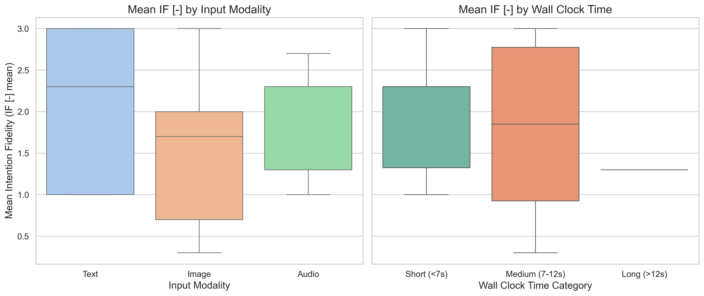
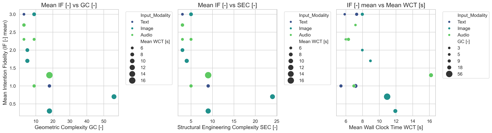
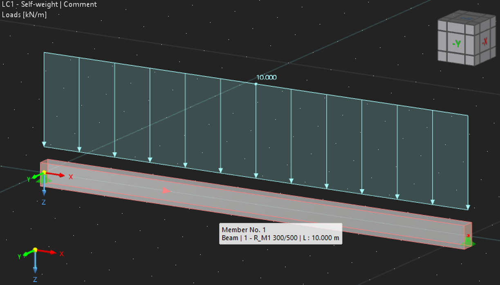

<!--https://mkrausai.github.io/research/01_SciML/02_Overstrength-->

# Structural Design Workflows using Multi-Modal Human-Machine-Interfaces in Dlubal RFEM for Concrete Analysis and Design

<!-- A repository of structural information on the design of pedestrian bridges
============================== -->

*   [Abstract](#Abstract)
*   [Introduction](#intro)
*   [Methods](#methods)
*   [Results](#results)
*   [Conclusions and Outlook](#Conclusions)
*   [Literature](#Literature)
*   [Contributors](#contributors)

<!-- -->
<!-- *   [Citation](#citation)-->

## Abstract
This paper introduces an innovative approach to structural concrete analysis and design by inte-grating multi-modal Large Language Models (mmLLMs) with Dlubal’s API, creating an intelligent assistant for interpreting images, text and voice commands. We propose structured data extraction prompt patterns with data validation as reusable templates for mmLLMs to extract desired data from unstructured data such as text, images or voice. The method reduces manual effort in mod-elling reinforced concrete structures by translating design specifications into precise RFEM/RSTAB models for e.g. geometry, material, load and solver setting handling. Case studies evaluate the quality and sensitivity of the approach. This workflow marks a significant step to-ward more intuitive and interactive structural design tools with state-of-the-art human-computer-interfaces.

<!-- The publication can be found <a href="https://onlinelibrary.wiley.com/doi/10.1002/cepa.2587" target="_blank">here</a> and the corresponding presentation video <a href="https://youtu.be/h-iBCey2fKo" target="_blank">here</a>. -->

## Introduction
Recent advancements in machine learning and deep learning have profoundly influenced engineering, introducing powerful tools for surrogate modeling, generative design, and optimization. A particularly novel development is the integration of multi-modal Large Language Models (mmLLMs) into structural engineering workflows. These models enable intuitive human-computer interaction, allowing engineers to translate natural language and image inputs into precise structural models using platforms like Dlubal’s RFEM/RSTAB API. However, ensuring the reliability and accuracy of such automated processes requires robust data validation and prompt engineering techniques. This paper explores a comprehensive framework combining mmLLMs, data validation, and structured output extraction to streamline and enhance structural design automation.

<figure>
  
  <figcaption style="font-style: italic; margin-top: 10px;">
    Fig. 1: Workflow illustrating the conversion of multi-modal inputs (image, text, speech) into RFEM model code definitions using a multi-modal foundation model.
  </figcaption>
</figure>

## Methods

In this study, we introduce a robust template-driven method for generating Dlubal RFEM Python API code using advanced prompt engineering, data validation, and structured output techniques. Our approach ensures precise, consistent, and replicable extraction of structural engineering data from text or images, regardless of the language model or application context. Built on domain expertise and the Dlubal Python library, this modular framework empowers prompt engineers to automate and streamline code generation for structural analysis-especially for concrete structures-while maintaining accuracy and adaptability across various scenarios.

###  RFEM Code Generation
A Python template RFEM (rfem_script_generator.py) is proposed to automate the creation of RFEM models by translating structured data from input text, voice or images via a mmLLM into executable Python scripts compatible with the RFEM software via its API. It systematically con-structs script components corresponding to defined elements of the structural analysis process - such as materials, sections, nodes, and loads - ensuring accurate representation within the RFEM environment. This automation enhances efficiency and reduces potential for human error in the modeling process.

###  Prompt Engineering and Function Calling
Prompt engineering involves crafting precise input prompts to guide mmLLMs, which in this study is solely openAI gpt 4o, toward producing desired outputs. By designing effective prompts, we can instruct the model to generate code structures that align with RFEM requirements. This technique has been instrumental in various applications, including structured data extraction from unstructured text. In our approach, we utilized prompt patterns to define the syntax and semantics of RFEM code components, ensuring that the generated code adheres to the expected format and functionality. This method allows for the creation of reusable templates that can be adapted to different scenarios within the RFEM framework.

###  Data Validation
Ensuring the accuracy and reliability of the generated code necessitates robust data validation mechanisms. We incorporated validation techniques using Pydantic to verify that the code pro-duced by the mmLLM meets the structural and logical constraints inherent to RFEM applications. An example is shown in Fig. 1. This involves checking for syntax errors, logical inconsistencies, and adherence to domain-specific standards. By implementing these validation steps, we aim to enhance the quality and trustworthiness of the generated code, which is crucial for applications in safety-critical domains.

###  Structured Output Generation
Structured output generation refers to the ability of LLMs to produce outputs that conform to predefined formats, such as JSON or YAML This capability is essential for integrating the generated code into existing systems and workflows without the need for extensive post-processing. Recent advancements have enabled LLMs to generate structured data directly, facili-tating seamless integration into various applications. In our methodology, we defined the desired output schema and utilized the LLM's structured output capabilities to generate RFEM code that aligns with this schema, thereby streamlining the code generation process and reducing the poten-tial for errors during integration.

##  Experimental Setup

Our proposed method is evaluated via several examples with varying complexity and modes (text, voice, image). We conduct the experiment of generating RFEM API code in Python with 3 repetitions. The details on data stratification guidelines, the concrete examples and evaluation metrics are specified in the latter of this section.

###  Data Stratification for the Evaluation Examples
We synthetically construct a small evaluation data set based on two major stratification principles:

- **Geometric Complexity (GC):**  
  Defined by the total number of vertices, edges, and faces in each example. Objects with more faces and vertices are classified as more complex, while those with fewer are considered simpler.

- **Structural Engineering Complexity (SEC):**  
  Defined by the total number of load and support conditions. Examples with more support conditions or loads are considered more complex.

These principles allow us to systematically assess and compare the performance of our approach across varying levels of geometric and structural complexity.

###  Examples
The study conducted a series of experiments to evaluate the framework's capability in pro-cessing diverse input formats - text, images, and audio - for generating RFEM models. Each ex-periment involved specific input data and was assessed based on the previously described met-rics. Table 1 provides a comprehensive overview of these experiments.

| Experiment No. | Input Modality | Description |
|:--------------:|:--------------:|:------------|
| 1-5            | Text           | Concrete beams, columns, slabs, and walls with varying dimensions, supports, and loads. |
| 6-10           | Image          | Structural models provided as images. |
| 11-15          | Audio          | Verbal descriptions corresponding to experiments 1-5. |

###  Evaluation Metrics
The RFEM files generated via the mmLLM approach are evaluated under the following metrics:
- **Compilation Complexity (CC):** Measures how many attempts the LLM needs to generate correct RFEM code. "Easy" = ≤2 attempts; "Hard" = >2 attempts.
- **Wall Clock Time (WCT):** Time taken to generate the RFEM file.
- **Intention Fidelity (IF):** Human-graded score (0–3) reflecting how well the generated model matches the intended design.

##  Results
This section summarizes the results of the approach towards the examples across different modes.

##  Code Repository Structure
The resulting Python files of our project are structured as follows:
- [📥 llm_processor.py](llm_processor.py): Extracts RFEM entities from text and images using GPT models, translating unstructured input into structured data.
- [📥 rfem_script_generator.py](rfem_script_generator.py)
- [📥 models.py](models.py): Defines Pydantic data structures for RFEM entities (materials, geometry, supports, loads).
- [📥 main.py](main.py): Orchestrates the workflow, processes inputs, and generates RFEM models.
- [📥 requirements.txt](requirements.txt): Requirements file.

This modular design ensures maintainability and scalability.

##  RFEM Models of the Examples and Statistics

<figure>
  
  <figcaption style="font-style: italic; margin-top: 10px;">
    Fig. 2: Boxplots: (left) Input Modality vs IF mean, (right) Mean IF vs WCT.
  </figcaption>
</figure>

<figure>
  
  <figcaption style="font-style: italic; margin-top: 10px;">
    Fig. 3: Scatterplot of mean IF against: (left) GC, (middle) SEC, (right) mean WCT.
  </figcaption>
</figure>

- **Text inputs**: Fastest processing (mean WCT ≈ 6.34s), high intention fidelity (IF ≈ 2.3–3.0), especially for simple models.
- **Image inputs**: Higher computational demands (mean WCT ≈ 9.55s), greater variability in IF (0.3–1.7), especially as complexity increases.
- **Audio inputs**: Intermediate performance (mean WCT ≈ 8.93s), IF scores between 1.0–2.7.

**Key findings:**
- Higher geometric and structural complexity leads to lower intention fidelity and longer processing times.
- Text and audio modalities are more reliable for conveying complex design intent.
- Compilation complexity ("easy" vs. "hard") significantly impacts both WCT and IF.

<figure>
  
  <figcaption style="font-style: italic; margin-top: 10px;">
    Fig. 4: Example E1 of a successfully generated RFEM model as a result of our pipeline.
  </figcaption>
</figure>

##  Discussion & Limitations
Comprehensive analysis revealed clear relationships between intention fidelity (IF), computational efficiency (wall clock time, WCT), and complexity parameters (geometric and structural) across text, image, and audio inputs. Text inputs were the fastest and most accurate, especially for simpler models (mean WCT ≈ 6.34s, IF ≈ 2.3–2.7). Image inputs required more computation (mean WCT ≈ 9.55s) and showed greater variability and lower IF under complex conditions. Audio inputs performed intermediately. Higher complexity reduced both efficiency and fidelity, with "hard" cases taking longer and being less accurate. Limitations include small sample size, qualitative complexity assessment, and limited error diagnostics, indicating the need for broader, more quantitative future studies. In brief:
- **Sample size**: Limited to 15 experiments and one LLM provider (OpenAI).
- **Complexity quantification**: Especially for images, remains qualitative.
- **Error analysis**: More granular diagnostics needed for failed cases.

Future work should address these by expanding datasets, refining complexity metrics, and improving error tracking.

##  Conclusion & Outlook
This study highlights how input modality and task complexity affect the efficiency and accuracy of multimodal large language models (mmLLMs) in structural model generation. Text inputs are fastest and most reliable for routine tasks, while image inputs demand more computation, especially with complex structures. Audio offers a balanced alternative. Structured data validation, such as with Pydantic, improves output reliability. The research also identifies the need for integrating domain knowledge via Retrieval-Augmented Generation (RAG) to address current limitations in specialized engineering concepts. Future directions include combining mmLLMs with physics-informed neural networks and grammar-based techniques to further advance automated structural engineering design. So key take-aways are:
- **Input modality** and **task complexity** are critical for optimal performance.
- Structured validation (e.g., Pydantic) enhances reliability and accuracy.
- **Retrieval-Augmented Generation (RAG)** and **physics-informed neural networks (PINNs)** are promising directions to enrich domain knowledge and improve model precision.
- LLMs have significant potential to automate and streamline structural engineering design, especially as domain integration and model interpretability improve.

## Contributors
- **Univ.-Prof. Dr. Michael A. Kraus, M.Sc.(hons)**
- **M.Sc. Isamu Lautenschläger**
- **Dr. Jaroslav Broz**
- **Georg Dlubal**

# Contact
Univ.-Prof. Dr. Michael A. Kraus, M.Sc.(hons) 
Institute für Statik und Konstruktion (ISM+D) 
TU Darmstadt 
kraus@ismd.tu-darmstadt.de 
<a href="https://www.ismd.tu-darmstadt.de/das_institut_ismd/mitarbeiter_innen_ismd/team_ismd_details_109888.de.jsp">
  Visit Univ.-Prof. Dr. Michael A. Kraus
</a>

------------
Shield: [![CC BY 4.0][cc-by-shield]][cc-by]

This work is licensed under a
[Creative Commons Attribution 4.0 International License][cc-by].

[![CC BY 4.0][cc-by-image]][cc-by]

[cc-by]: http://creativecommons.org/licenses/by/4.0/
[cc-by-image]: https://i.creativecommons.org/l/by/4.0/88x31.png
[cc-by-shield]: https://img.shields.io/badge/License-CC%20BY%204.0-lightgrey.svg

