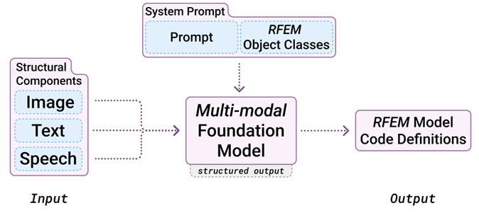

<!--https://mkrausai.github.io/research/01_SciML/02_Overstrength-->

# Structural Design Workflows using Multi-Modal Human-Machine-Interfaces in Dlubal RFEM for Concrete Analysis and Design

<!-- A repository of structural information on the design of pedestrian bridges
============================== -->

*   [Abstract](#Abstract)
*   [Introduction](#intro)
*   [Methods](#methods)
*   [Results](#results)
*   [Conclusions and Outlook](#Conclusions)
*   [Literature](#Literature)
*   [Contributors](#contributors)

<!-- -->
<!-- *   [Citation](#citation)-->

## Abstract
This paper introduces an innovative approach to structural concrete analysis and design by inte-grating multi-modal Large Language Models (mmLLMs) with Dlubal’s API, creating an intelligent assistant for interpreting images, text and voice commands. We propose structured data extraction prompt patterns with data validation as reusable templates for mmLLMs to extract desired data from unstructured data such as text, images or voice. The method reduces manual effort in mod-elling reinforced concrete structures by translating design specifications into precise RFEM/RSTAB models for e.g. geometry, material, load and solver setting handling. Case studies evaluate the quality and sensitivity of the approach. This workflow marks a significant step to-ward more intuitive and interactive structural design tools with state-of-the-art human-computer-interfaces.

<!-- The publication can be found <a href="https://onlinelibrary.wiley.com/doi/10.1002/cepa.2587" target="_blank">here</a> and the corresponding presentation video <a href="https://youtu.be/h-iBCey2fKo" target="_blank">here</a>. -->

## Introduction
Recent advancements in machine learning and deep learning have profoundly influenced engineering, introducing powerful tools for surrogate modeling, generative design, and optimization. A particularly novel development is the integration of multi-modal Large Language Models (mmLLMs) into structural engineering workflows. These models enable intuitive human-computer interaction, allowing engineers to translate natural language and image inputs into precise structural models using platforms like Dlubal’s RFEM/RSTAB API. However, ensuring the reliability and accuracy of such automated processes requires robust data validation and prompt engineering techniques. This paper explores a comprehensive framework combining mmLLMs, data validation, and structured output extraction to streamline and enhance structural design automation.

<figure>
  
  <figcaption style="font-style: italic; margin-top: 10px;">
    Fig. 1: Workflow illustrating the conversion of multi-modal inputs (image, text, speech) into RFEM model code definitions using a multi-modal foundation model.
  </figcaption>
</figure>

## Methods

In this study, we introduce a robust template-driven method for generating Dlubal RFEM Python API code using advanced prompt engineering, data validation, and structured output techniques. Our approach ensures precise, consistent, and replicable extraction of structural engineering data from text or images, regardless of the language model or application context. Built on domain expertise and the Dlubal Python library, this modular framework empowers prompt engineers to automate and streamline code generation for structural analysis-especially for concrete structures-while maintaining accuracy and adaptability across various scenarios.

###  RFEM Code Generation
A Python template RFEM (rfem_script_generator.py) is proposed to automate the creation of RFEM models by translating structured data from input text, voice or images via a mmLLM into executable Python scripts compatible with the RFEM software via its API. It systematically con-structs script components corresponding to defined elements of the structural analysis process - such as materials, sections, nodes, and loads - ensuring accurate representation within the RFEM environment. This automation enhances efficiency and reduces potential for human error in the modeling process.

###  Prompt Engineering and Function Calling
Prompt engineering involves crafting precise input prompts to guide mmLLMs, which in this study is solely openAI gpt 4o, toward producing desired outputs. By designing effective prompts, we can instruct the model to generate code structures that align with RFEM requirements. This technique has been instrumental in various applications, including structured data extraction from unstructured text. In our approach, we utilized prompt patterns to define the syntax and semantics of RFEM code components, ensuring that the generated code adheres to the expected format and functionality. This method allows for the creation of reusable templates that can be adapted to different scenarios within the RFEM framework.

###  Data Validation
Ensuring the accuracy and reliability of the generated code necessitates robust data validation mechanisms. We incorporated validation techniques using Pydantic to verify that the code pro-duced by the mmLLM meets the structural and logical constraints inherent to RFEM applications. An example is shown in Fig. 1. This involves checking for syntax errors, logical inconsistencies, and adherence to domain-specific standards. By implementing these validation steps, we aim to enhance the quality and trustworthiness of the generated code, which is crucial for applications in safety-critical domains.

###  Structured Output Generation
Structured output generation refers to the ability of LLMs to produce outputs that conform to predefined formats, such as JSON or YAML This capability is essential for integrating the generated code into existing systems and workflows without the need for extensive post-processing. Recent advancements have enabled LLMs to generate structured data directly, facili-tating seamless integration into various applications. In our methodology, we defined the desired output schema and utilized the LLM's structured output capabilities to generate RFEM code that aligns with this schema, thereby streamlining the code generation process and reducing the poten-tial for errors during integration.

##  Experimental Setup

Our proposed method is evaluated via several examples with varying complexity and modes (text, voice, image). We conduct the experiment of generating RFEM API code in Python with 3 repetitions. The details on data stratification guidelines, the concrete examples and evaluation metrics are specified in the latter of this section.

###  Data Stratification for the Evaluation Examples
We synthetically construct a small evaluation data set based on two major stratification principles:

- **Geometric Complexity (GC):**  
  Defined by the total number of vertices, edges, and faces in each example. Objects with more faces and vertices are classified as more complex, while those with fewer are considered simpler.

- **Structural Engineering Complexity (SEC):**  
  Defined by the total number of load and support conditions. Examples with more support conditions or loads are considered more complex.

These principles allow us to systematically assess and compare the performance of our approach across varying levels of geometric and structural complexity.

###  Examples
The study conducted a series of experiments to evaluate the framework's capability in pro-cessing diverse input formats - text, images, and audio - for generating RFEM models. Each ex-periment involved specific input data and was assessed based on the previously described met-rics. Table 1 provides a comprehensive overview of these experiments.

###  Structured Output Generation

2.4	

<figure>
  
  <figcaption style="font-style: italic; margin-top: 10px;">
    Fractured specimen with impact influence zone and NCA training region (green box).
  </figcaption>
</figure>

###  Neural Cellular Automata (NCA)
The proposed NCA framework, based on Mordvintsev et al. (2020), operates on a 2D grid with 12 channels per cell. It uses convolutional kernels and a compact neural network to model fracture patterns. An update step is illustrated below:
<figure style="text-align: center;">
  
  <figcaption style="font-style: italic; margin-top: 10px;">
    Training scheme for NCA model based on Mordvintsev et al. (2020).
  </figcaption>
</figure>

The NCA applies a stochastic update rule and uses a small network with 5,856 parameters, achieving efficient grid-based fracture texture simulations. Despite its small size, the model performs well without requiring hyperparameter optimization.

###  Evaluation Metrics of Fractured Glass
The fractured shards, generated by the NCA and ground truth data, were evaluated using qualitative and quantitative methods:
<ul>
  <li><strong>Area:</strong> Number of pixels constituting a shard</li>
  <li><strong>Orientation:</strong> Angle between the x-axis and the shard's major axis</li>
  <li><strong>Eccentricity:</strong> Elongation of a shard from circular (0) to linear (1)</li>
  <li><strong>Perimeter:</strong> Boundary length of a shard</li>
  <li><strong>Major Axis Length</strong></li>
  <li><strong>Minor Axis Length</strong></li>
</ul>
These metrics provided a robust framework for assessing the fidelity and diversity of the generated fracture patterns compared to the ground truth.

Instead of using conventional metrics such as Fréchet inception distances (FID), this study compares the probability distributions of geometric features (e.g., area, perimeter) extracted from images at time steps \( t \geq 0.5 \), following the approach of Kraus et al. (2019).

##  Results
The following images show sample frames ("Frame 0" to "Frame 5") from the NCA training process at various time steps. Qualitatively, there is strong agreement between the ground truth fracture pattern and the textures learned by the NCA, especially for training times t ≥ 0.5.

  <figure style="text-align: center;">
    
    <figcaption style="font-style: italic; margin-top: 10px;">
      Frame 1: \( t = 0 \)
    </figcaption>

  </figure>
  <figure style="text-align: center;">
    
    <figcaption style="font-style: italic; margin-top: 10px;">
      Frame 2: \( t = 0.25 \)
    </figcaption>

  </figure>
  <figure style="text-align: center;">
    
    <figcaption style="font-style: italic; margin-top: 10px;">
      Frame 3: \( t = 0.50 \)
    </figcaption>
  </figure>
  <figure style="text-align: center;">
    
    <figcaption style="font-style: italic; margin-top: 10px;">
      Frame 4: \( t = 0.75 \)
    </figcaption>
  </figure>
  <figure style="text-align: center;">
    
    <figcaption style="font-style: italic; margin-top: 10px;">
      Frame 5: \( t = 1.0 \)
    </figcaption>
  </figure>
  <figure style="text-align: center;">
    
    <figcaption style="font-style: italic; margin-top: 10px;">
      Ground Truth
    </figcaption>
  </figure>

We provide a video of the trained NCA generating fracture patterns of tempered glass here: 

  <video autoplay loop muted style="width: 10cm; height: 10cm;">
    <source src="NCA_FracturedGlass.mp4" type="video/mp4">
    Your browser does not support the video tag.
  </video>
  

    Video of the NCA generating fracture patterns of tempered glass with 
    <code>UD = 8,738.2 J/m³</code> (<code>Uσm = 31.5 MPa</code>) in an area of 50 x 50 mm.
  

For the main geometric evaluation metrics (area, perimeter, major axis length, minor axis length) we provide the histograms using 10-log of the metrics due to their numerical values spanning several scales:

  <!-- Log Area -->
  <figure style="text-align: center; width: 45%;">
    
  </figure>
    
  <!-- Log Perimeter -->
  <figure style="text-align: center; width: 45%;">
    
  </figure>
  
  <!-- Log Major Axis Length -->
  <figure style="text-align: center; width: 45%;">
    
  </figure>
  
  <!-- Log Minor Axis Length -->
  <figure style="text-align: center; width: 45%;">
    
  </figure>

##  Conclusions and Outlook
This study demonstrates the efficacy of Neural Cellular Automata (NCA) for modeling tempered glass fracture patterns, outperforming traditional methods in speed and accuracy. By capturing intricate morphologies and stochastic variability, NCA effectively replicates complex fracture patterns with strong alignment to ground truth data, as evidenced by metrics such as perimeter, area, and axis lengths.

However, key limitations include the use of a single training image and the lack of temporal data to model dynamic fracture processes. Addressing these challenges could significantly enhance the model's capabilities. Incorporate high-speed imaging data (e.g., Riedel et al., 2024) to enable NCA training with spatio-temporal sequences, simulating crack propagation dynamics.

Develop a Conditional Variational NCA (VNCA) framework to generate fracture patterns specific to varying prestress levels, capturing full stochastic variability and correlation structures inherent in fracture data. Explore probabilistic methods and conduct hyperparameter searches to optimize the model's architecture, further improving  accuracy and generalizability.

These advancements could expand the applicability of NCA in structural glass engineering, providing powerful tools for simulating and analyzing fracture patterns under diverse conditions.

##  Conclusions and Outlook
This study addresses the regression of overstrength factors for specific types of steel sections. We propose novel methods for formulating relations between cross-sectional features and the overstrength of beams in CHS, RHS, SHS, I, and H sections. We introduce a multi-head encoder-regressor Deep Neural Network (MHER-DNN) architecture to predict the overstrength factor and learn a compressed representation of section-specific inputs for regression and inspection purposes. Experimental data for different cross sections are used to train and validate the MHER-DNN. The model shows reasonable precision and accuracy compared to existing models. We also explore the disentanglement of the latent space representation of the MHER-DNN, allowing for common feature derivation and human interpretation. Future research involves further tuning of hyperparameters, investigating hybrid autoencoder-multi-head regressor architectures, and establishing Eurocode-compliant models for engineering design practice.

##  Literature

<ul>
  <li>
    Pourmoghaddam, N., Kraus, M. A., Schneider, J., & Siebert, G. (2019). 
    <em>Relationship between strain energy and fracture pattern morphology of thermally tempered glass for the prediction of the 2D macro-scale fragmentation of glass</em>. 
    <strong>Glass Structures & Engineering</strong>, 4(2), 257–275.
  </li>
  <li>
    Kraus, M. A. (2019). 
    <em>Machine learning techniques for the material parameter identification of laminated glass in the intact and post-fracture state</em>. 
    <strong>Universität der Bundeswehr</strong>.
  </li>
  <li>
    Tang, J., Kumar, S., De Lorenzis, L., & Hosseini, E. (2023). 
    <em>Neural Cellular Automata for Solidification Microstructure Modelling</em>. 
    <strong>Computer Methods in Applied Mechanics and Engineering</strong>, 414, 116197.
  </li>
  <li>
    Mordvintsev, A., & Niklasson, E. (2021). 
    <em>μ NCA: Texture generation with ultra-compact neural cellular automata</em>. 
    <strong>arXiv preprint</strong>, arXiv:2111.13545.
  </li>
  <li>
    Drass, M., Berthold, H., Kraus, M. A., & Müller-Braun, S. (2021). 
    <em>Semantic segmentation with deep learning: detection of cracks at the cut edge of glass</em>. 
    <strong>Glass Structures & Engineering</strong>, 6(1), 21–37.
  </li>
  <li>
    Riedel, H., Bohmann, L., Bagusat, F., Sauer, M., Schuster, M., & Seel, M. (2024). 
    <em>Crack segmentation for high-speed imaging: detection of fractures in thermally toughened glass</em>. 
    <strong>Glass Structures & Engineering</strong>, 1–14.
  </li>
</ul>

## Contributors

  

    
    
 
      <strong>Univ.-Prof. Dr. Michael A. Kraus, M.Sc.(hons)</strong>  
      Professor Structural Mechanics and Design at TU Darmstadt 
    

  

  

    
    

      <strong>Univ.-Prof. Dr. Jens Schneider</strong>  
      President of TU Wien 
    

  

# Contact
Univ.-Prof. Dr. Michael A. Kraus, M.Sc.(hons) 
Institute für Statik und Konstruktion (ISM+D) 
TU Darmstadt 
kraus@ismd.tu-darmstadt.de 
<a href="https://www.ismd.tu-darmstadt.de/das_institut_ismd/mitarbeiter_innen_ismd/team_ismd_details_109888.de.jsp">
  Visit Univ.-Prof. Dr. Michael A. Kraus
</a>

------------
Shield: [![CC BY 4.0][cc-by-shield]][cc-by]

This work is licensed under a
[Creative Commons Attribution 4.0 International License][cc-by].

[![CC BY 4.0][cc-by-image]][cc-by]

[cc-by]: http://creativecommons.org/licenses/by/4.0/
[cc-by-image]: https://i.creativecommons.org/l/by/4.0/88x31.png
[cc-by-shield]: https://img.shields.io/badge/License-CC%20BY%204.0-lightgrey.svg

